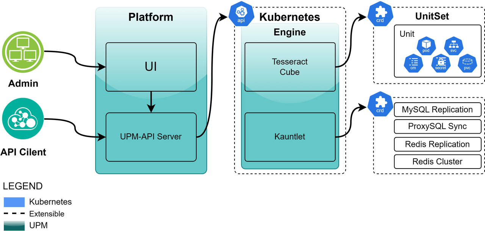

# Architecture

## Architecture

<figure><figcaption></figcaption></figure>

UPM is a complex system consisting of many different parts. To help UPM users and developers build theoretical models of how it works, this page records the system architecture.

UPM adopts the classic "hub-agent" architecture design, divided into two parts: management platform layer and execution engine layer. It can meet the needs of Kubernetes multi-cluster orchestration and is a powerful, modular and scalable platform. In UPM, we will break out of the past centralized design ideas and imperative architectures, and embrace the "hub-agent" architecture that is consistent with the original "hub-kubelet" pattern in Kubernetes. Therefore, in UPM, our management platform layer is intuitively modeled as "Hub", while in contrast, each cluster managed by "Hub" is "agent". Here is a more detailed explanation of the two models, which we will use frequently in the UPM world:

* **UPM** **Platform**: UPM's core control platform is used to provide API interfaces to the outside world and manage resource object CRs in the Kubernets API using workflow methods. Using the "microservices" architecture design, it can quickly scale and meet the operation and maintenance needs of a variety of databases and middleware.
* **UPM** **Engine**: UPM's execution engine, designed using the Kubernetes Operator framework, is a set of Kubernetes-based extension suites that focus on general stateful service automation and advanced operation and maintenance automation\* of data applications. \* is composed of two independently developed operators in Kubernetes. In order to better support multiple database types and support cluster architectures of multiple databases, we designed a general workload to meet the workload management model of database and middleware services.

Benefiting from the advantages of the architecture, at the abstract level, we decouple most of the multi-cluster operations into (1) computing/decision and (2) execution, and the actual execution of the target cluster will be completely unloaded into **UPM. \*\* In Engine, and UPM Platform will focus on better orchestrating tasks and interface calls through workflows. UPM Engine will not perform operations directly, but will declaratively maintain the CRD in each cluster. UPM Platform will actively pull the CRD status from Kubernets and arrange the next task content. The task burden of UPM Platform** will be greatly reduced because UPM Platform\*\* does not need to handle event torrents from Kubernetes clusters, nor does it need to send a large number of requests to various Kubernetes clusters. Just imagine, if there are no kubelets in Kubernetes, but the control plane directly operates the container daemon, it will be extremely difficult for a centralized controller to manage a cluster of more than 5,000 nodes. Similarly, this is also how UPM tries to break through the scalability bottleneck, i.e. disassemble the "execution" split into individual agents, so that **UPM Platform** can accept and manage multiple clusters.

## Overall architecture diagram

<figure><figcaption></figcaption></figure>

## UPM Platform

UPM Platform is UPM's core control platform, used to provide API interfaces to manage execution workflows. Designed with the Microservices architecture to scale quickly.

### Architecture

<figure><figcaption></figcaption></figure>

UPM Platform consists of three parts:

* **UPM** **UI**: The management interface provided by UPM provides a unified UI interface for administrators.
* **UPM** **API-Server**: UPM Platform management core, designed and developed based on the SpringCloud microservice framework, uses Restful API to provide management capabilities, uses MySQL database to store management data, and uses Redis cache to accelerate data query capabilities.

### Microservice design

As the management core, UPM API-Server plays an important core role. It needs to meet the growing operation and maintenance needs of users and the emerging new service management needs in the open source community. Microservice design is an architectural design that can meet the above needs. Microservices: The architectural style that breaks down application functionality into a set of services. Each service is a focused, cohesive functional responsibility group. Each service is loosely coupled, has its own private database, and communicates through the API. Each service can be developed, deployed, tested and extended independently.

#### List of microservice modules

| Serial number | Name                  | Description                                                                                                                                                    |
| ------------- | --------------------- | -------------------------------------------------------------------------------------------------------------------------------------------------------------- |
| 1             | Gateway API           | The Gateway API module is responsible for receiving external requests and routing them to the corresponding microservice module                                |
| 2             | Auth                  | The Auth module is responsible for user authentication and permission management                                                                               |
| 3             | Resource              | Resource module provides management of system resources, such as projects, Kubernetes clusters, nodes, storage classes, software, etc.                         |
| 4             | User                  | User module is responsible for the management and operation of user information.                                                                               |
| 5             | OperatorLog           | OperatorLog module records system operation logs and is used to track system operations.                                                                       |
| 6             | MySQL service         | MySQL service module provides the complete operation and maintenance workflow control and management functions of MySQL database.                              |
| 7             | Redis service         | Redis service module provides complete operation and maintenance workflow control and management functions of Redis cache.                                     |
|               | Redis-Cluster service | The Redis-Cluster service module provides the complete operation and maintenance workflow control and management functions of Redis cluster cache.             |
| 8             | Kafka service         | Kafka service module provides complete operation and maintenance workflow control and management functions of Kafka event flow.                                |
| 9             | Zookeeper service     | Zookeeper service module provides complete operation and maintenance workflow control and management functions for Zookeeper service discovery.                |
| 10            | Elasticsearch service | The Elasticsearch service module provides the complete operation and maintenance workflow control and management functions of the Elasticsearch search engine. |

## UPM Engine

UPM Engine is UPM's execution engine designed using the Kubernetes Operator framework. It is a set of Kubernetes-based extension suites that focus on general stateful service automation and advanced operation and maintenance automation\* for data applications. \* is composed of two independently developed operators in Kubernetes. In order to better support multiple database types and support cluster architectures of multiple databases, we designed a general workload to meet the workload management model of database and middleware services.

### Architecture

<figure><figcaption></figcaption></figure>

UPM Engine consists of two parts:

* **Unit** **Operator**: is a general workload operator that implements enhancement and extension of stateful services of databases and middleware.
* **Compose Operator**: It is an operator with advanced operation and maintenance operations. It uses an extensible CRD method to supplement the complex operation and maintenance functions in special operation and maintenance scenarios.

### Operator Design

In the fields of robotics and automation, a control loop is a non-termination loop that regulates the state of the system.

Here is an example of a control ring: the temperature automatic regulator in the room.

When you set the temperature, tell the temperature autoregulator your Desired State\*\*. The actual temperature of the room is **Current State**. By switching control of the device, the temperature automatic regulator brings its current state closer to the desired state.

In Kubernetes, The controller monitors the common state of the cluster and works to transform the current state into the desired state..

Kubernetes takes a cloud-native view of the system and can handle continuous changes.

During task execution, the cluster may be modified at any time, and the control loop will automatically repair the fault. This means that it is very likely that the cluster will never reach a stable state.

As long as the controller in the cluster is running and is modified effectively, it is irrelevant to the stability of the overall state.

As one of the design principles, UPM uses multiple controllers, each managing a specific aspect of the cluster state. The most common one particular controller uses one type of resource as its desired state, and the controller manages to control another type of resource to evolve to its desired state. For example, the UnitSet's controller tracks Unit objects (to discover new tasks) and Pod objects (to run Unit and then see when the task is completed). In this case, the new task creates a Unit and the Unit controller creates a Pod.

It is useful to use a simple controller instead of a set of interconnected monolithic control loops. The controller fails, so the UPM design takes this into account.

### **Unit Operator**

Unit Operator is a general workload operator, used to unify the workload management capabilities of database and middleware, avoiding the problem of managing different operators.

* UPM contains a common set of Workloads, Unit, UnitSet. These workloads can support multiple types of database and middleware services
* Use templates to define workloads scalable, a new extension method that can help customers define and extend services of specific types and versions, such as adding definitions of Sidecar containers, automatically injecting monitoring programs or security check containers by automatically checking them by adding definitions of Sidecar containers, or automatically injecting monitoring programs or security checking containers .
* Manage configuration and define expansion based on Template

Unit Operator is the core of control, which continuously tracks a type of Kubernetes resource. These CRDs have a representative of the expected state `spec`Field. The controller of this resource is responsible for ensuring that its current state is close to the expected state.

The controller may perform operations on its own; more commonly in Kubernetes, In Kubernetes it is more common for a controller to send information to the API server, this has side effects. For details, please refer to the following examples.

<figure><figcaption></figcaption></figure>

Unit Operator provides custom resource definitions (CRDs) for two common workloads,`UnitSet`and `Unit`,in particular `UnitSet`.It is the primary custom resource (CR) you interact with when using Unit Operator.

#### Unit

Unit is the process of filling items in a way that maximizes the use of boxes. This extends to Nomad, where the client is the "trash bin" and the project is the task group. Nomad optimizes resources by efficiently packing tasks onto client computers.

Unit (like a block on a Rubik's Cube) is the sum of resource objects required by a service instance. Unit contains one [Pod](https://kubernetes.io/zh-cn/docs/concepts/workloads/pods/), configuration files([Configmap](https://kubernetes.io/zh-cn/docs/concepts/configuration/configmap/)) used to run the service, persistence of storage data usage storage volume;Unit is a complete service instance life cycle management to integrate and utilize the necessary resources included in service operation and maintenance.

#### UnitSet

UnitSet is a workload API object used to manage common stateful database instances.

UnitSet is used to manage the deployment and scaling of Unit collections, and provides persistent storage and persistent identifiers, configuration file templates, encryption information, authentication certificates, and rolling update policies for these Units. UnitSet manages a set of Units based on a set of Pod Constitutions of the same type.

The following figure out how to make the composition `UnitSet`.The key parts are highlighted with arrows pointing to the related objects. The following sections of this document explain the various parts of the figure.

<figure><figcaption></figcaption></figure>

### **Compose Operator**

Compose Operator is a Kubernetes-based project that aims to manage traditional database applications such as MySQL and Redis through custom resource definitions (CRDs). It simplifies the process of deploying and managing databases in Kubernetes clusters, and provides functions such as building MySQL master-slave replication relationships and building Redis cluster architecture.

Compose Operator is different from other operators in the community. It will not generate underlying Pod instances, and only manage the replication relationship between instances. Through this design, we can also manage database instances outside the Kubernetes cluster.

Compose Operator is built using the Operator framework.

Supported range of features

* **MysqlReplication**
* Manages the master-slave replication relationship between MySQL, and supports master-slave switching by changing the topology in Spec, and realizes read and write separation of MySQL master-slave replication service by updating Pod tags.`MysqlReplication`The deployment and configuration of MySQL master-slave replication can be automated, the replication status can be monitored, and the new master node can be automatically elected in the event of a master node failure. This ensures high availability and data consistency of the database cluster, reducing manual intervention and operation and maintenance costs.
* **RedisReplication**
* Manages the master-slave replication relationship between Redis, and supports skip-reconcile annotation, which is compatible with the redis sentinel architecture.`RedisReplication`The deployment and configuration of Redis master-slave replication can be automated, the replication status can be monitored, and the new master node can be automatically elected in the event of a master node failure. This ensures high availability and data consistency of the database cluster, reducing manual intervention and operation and maintenance costs.
* **RedisCluster**
* Automatically build the Redis Cluster cluster architecture according to member and supports automatic allocation of Slots.`RedisCluster`The deployment, configuration and monitoring of Redis Cluster architecture clusters can be automated to ensure high availability and performance of the cluster. It can dynamically adjust data sharding strategies based on the load conditions of the cluster and automatically fail over when node failures, thereby minimizing intervention in operation and maintenance personnel.
* **ProxysqlSync**
* Monitors the actual topological status in MysqlReplication CRDs, updates and maintains mysql\_server in ProxySQL, and supports automatic filtering rules to synchronize users in MySQL. Proxysql is a high-performance open source proxy for load balancing and failover of MySQL and PostgreSQL database clusters.`ProxysqlSync`It can automatically synchronize the database user and replicate topology information, assist MySQL in implementing data access routing and failover.

Our scalable advanced database operation and maintenance capabilities Operator helps users simplify database cluster management, improve operation and maintenance efficiency, reduce costs, and ensure high availability and stability of database clusters. At the same time, our Operator also supports customized expansion, which can flexibly add other database operation and maintenance capabilities according to user needs to meet the needs of different scenarios.

The following is the architecture diagram of our Compose Operator
